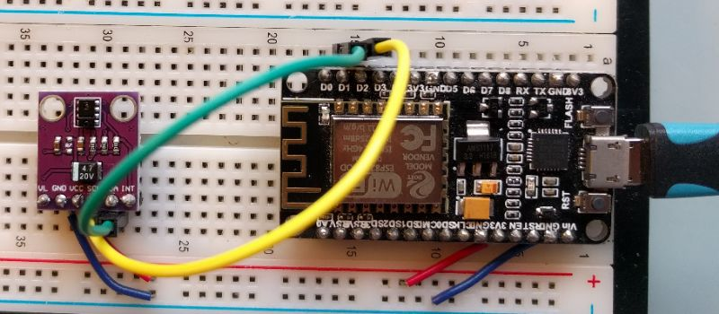

# upython_apds9930
micropython project using [apds9930](https://docs.broadcom.com/docs/AV02-3190EN)
using Node MCU ESP8266 micropython port 

eventually found a micropython library at
https://github.com/micropython-Chinese-Community/mpy-lib/tree/master/sensor/APDS9930

APDS9930 has two main features available in the library; ambient light sensing and a proximity sensor
